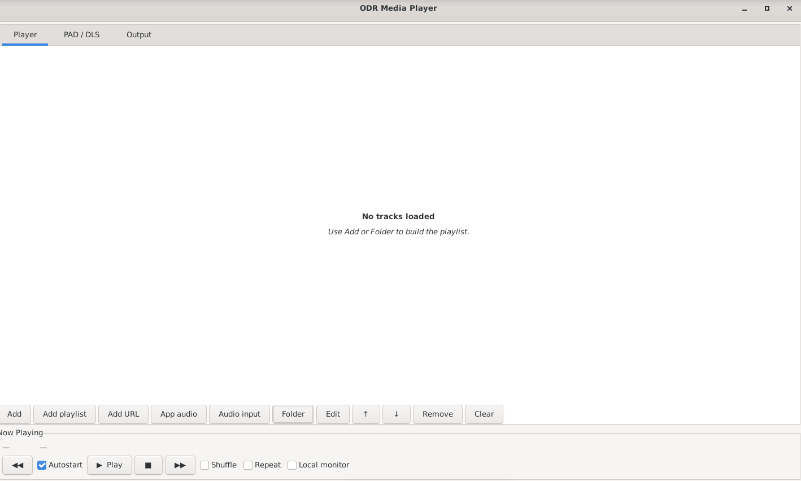
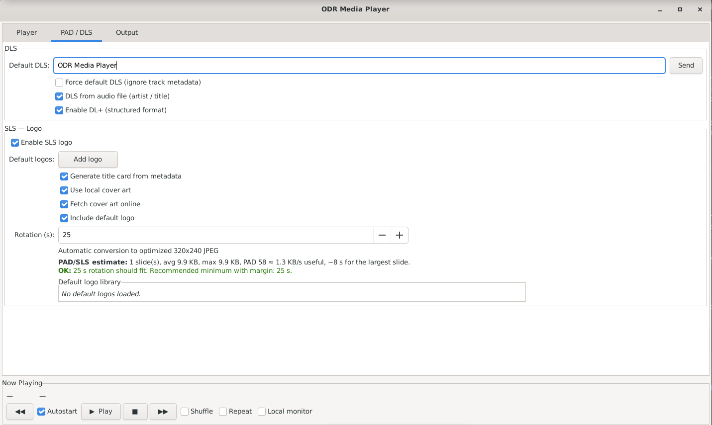
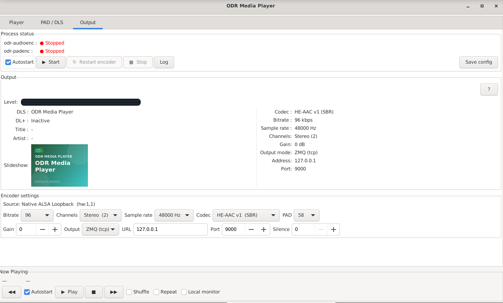

# ODR Media Player V1.1

`ODR Media Player` is a GTK3 desktop frontend for a local DAB+ playout and encoding chain based on:

- `GStreamer`
- `ALSA Loopback`
- `odr-audioenc`
- `odr-padenc`

It can play:

- local audio files
- web radio / stream URLs
- imported `M3U`, `M3U8` and `PLS` playlists
- live desktop app audio routed from PulseAudio / PipeWire
- live audio inputs exposed by PulseAudio / PipeWire

It can also generate and manage:

- `DLS`
- `DL+`
- `SLS / slideshow`
- generated title cards
- local and online cover-art lookup

## Features

- Persistent `Now Playing` strip visible from every tab
- Seek bar for local-file playback directly from the `Now Playing` strip
- Grouped playlist by music folder, with per-folder enable/disable state
- Playlist multi-selection for grouped remove / move operations
- Drag-and-drop reordering for folders and tracks
- Automatic folder watching for newly added local audio files
- Saved playlist loading in background with progressive UI population at startup
- Stream metadata parsing from GStreamer tags
- Live app-audio titling fallback from the captured application/window when available
- App-audio and audio-input capture
- Encoder control for `odr-audioenc` and `odr-padenc`
- `ZMQ (tcp)` or `EDI (udp)` output modes
- Informational silence / no-data warning without stopping the encoder chain
- Automatic retry of live sources when audio disappears
- Internal logo library for SLS
- Generated title cards with adaptive text layout
- Optional local cover-art usage and optional online cover-art lookup
- Cover-only slideshow rendering when real artwork is found
- PAD / SLS throughput estimate
- Debian menu integration when installed from the `.deb`

## V1.1 Highlights

- Folder-based player view with automatic detection of new tracks in watched music folders
- Direct seek control for local tracks
- Better live-source supervision with retry counter and non-blocking silence warnings
- Output preview aligned with the real `odr-padenc` slideshow state
- `EDI (udp)` output support corrected for `odr-audioenc`
- Updated Debian package build for `1.1.1`

## Screenshots

### Player



### PAD / DLS



### Output



## Runtime chain

```text
Audio path
  Files / URLs / App audio / Audio input
    -> GStreamer decode / playback
    -> ALSA Loopback playback side (hw:N,0)
    -> ALSA Loopback capture side (hw:N,1)
    -> odr-audioenc
    -> output transport: ZMQ (tcp://...) or EDI (udp://...)
    -> local / remote odr-dabmux input

PAD / metadata path (when enabled)
  Default DLS / file metadata / DL+ / generated slides / logo library
    -> DLS file + slideshow assets
    -> odr-padenc
    -> PAD socket identified by the PAD ID
    -> injected into odr-audioenc
```

## Installation

### Option 1: Install the Debian package

If you already built the package:

```bash
sudo apt install ./dist/odr-media-player_1.1.1_all.deb
```

This installs:

- the application launcher in `/usr/bin/odr-media-player`
- the desktop entry in `/usr/share/applications/odr-media-player.desktop`
- the icon in `/usr/share/icons/hicolor/256x256/apps/odr-media-player.png`

On Debian / Raspberry Pi OS Desktop, the app will then appear in the applications menu.

### Option 2: Install dependencies manually

On Debian / Ubuntu:

```bash
sudo ./install_dependencies.sh
```

This installs the core runtime dependencies and enables persistent `snd-aloop` loading when available.

### Option 3: Manual installation without helper script

Install at least:

```bash
sudo apt install \
  python3 \
  python3-gi \
  python3-cairo \
  python3-gi-cairo \
  gir1.2-gtk-3.0 \
  gir1.2-gstreamer-1.0 \
  gir1.2-gdkpixbuf-2.0 \
  gir1.2-pango-1.0 \
  gstreamer1.0-tools \
  gstreamer1.0-alsa \
  gstreamer1.0-plugins-base \
  gstreamer1.0-plugins-good \
  gstreamer1.0-plugins-bad \
  gstreamer1.0-plugins-ugly \
  gstreamer1.0-libav \
  alsa-utils \
  pulseaudio-utils \
  ffmpeg \
  imagemagick \
  kmod
```

If your desktop uses PipeWire instead of PulseAudio tools, install `pipewire-bin` as a compatible alternative for `pactl`.

Then install:

- `odr-audioenc`
- `odr-padenc`

If these packages are not available in your current repository, install them manually from your distribution backports or from your own build chain.

## Required components

### Mandatory for the GUI

- `python3`
- `PyGObject / GTK3`
- `GStreamer`
- `ALSA`
- `ffmpeg`

### Mandatory for the full encoder chain

- `odr-audioenc`
- `odr-padenc`
- `snd-aloop`

### Recommended

- `imagemagick`
  - better SLS conversion and optimization
- `pulseaudio-utils` or compatible `PipeWire` tools
  - needed for `App audio` and `Audio input`

## Enable ALSA loopback

Load it immediately:

```bash
sudo modprobe snd-aloop
```

Make it persistent across reboots:

```bash
echo snd-aloop | sudo tee /etc/modules-load.d/odr-fileplayer-snd-aloop.conf
```

## Launch from source

From the project directory:

```bash
python3 -m py_compile odr_fileplayer.py encodeur_dab_app/*.py
python3 odr_fileplayer.py
```

If needed on a desktop session:

```bash
DISPLAY=:0 python3 odr_fileplayer.py
```

## Build the Debian package

```bash
./build_deb.sh
```

Output:

```text
dist/odr-media-player_1.1.1_all.deb
```

## Configuration and runtime files

Main config file:

```text
~/.config/encodeur-dab.conf
```

Runtime files:

```text
/tmp/dab-encodeur.dls
/tmp/dab-encodeur-slides/
/tmp/dab-current-slide.jpg
```

App data:

```text
~/.local/share/odr-fileplayer/default-logos
~/.local/share/odr-fileplayer/cover-cache
```

## Notes

- The app is designed for a real encoder chain, so `Start`, `Restart encoder` and `Stop` act on real processes.
- `Local monitor` only duplicates audio locally and does not replace the encoder path.
- Local folder groups stay monitored automatically after import; new audio files can appear in the playlist a few seconds later after background probing.
- Saved playlists are restored progressively at startup; the UI may become usable before all local file metadata is loaded.
- Online cover-art lookup depends on metadata quality and may be imperfect for remixes or noisy stream titles.
- Silence detection is informational only. It does not stop `odr-audioenc` or `odr-padenc`.
- For slideshow reception tests, graphical receivers such as `dablin_gtk` are more useful than console-only players.

## License

This project is distributed under the MIT license.
See [LICENSE](LICENSE).
